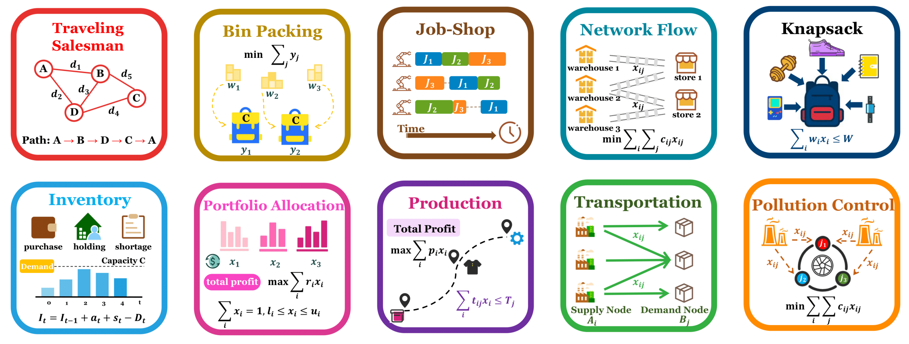
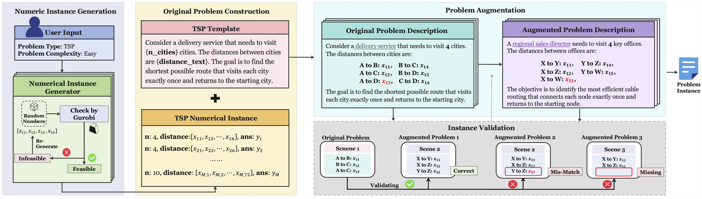
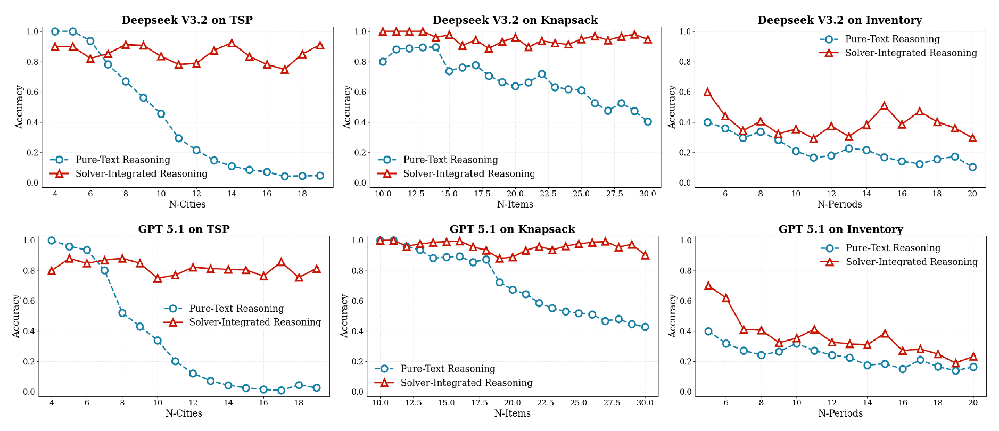
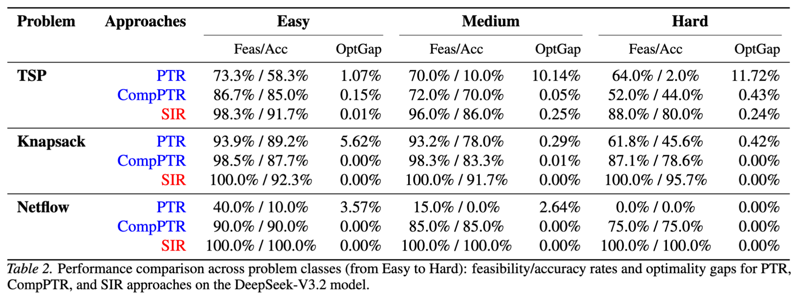
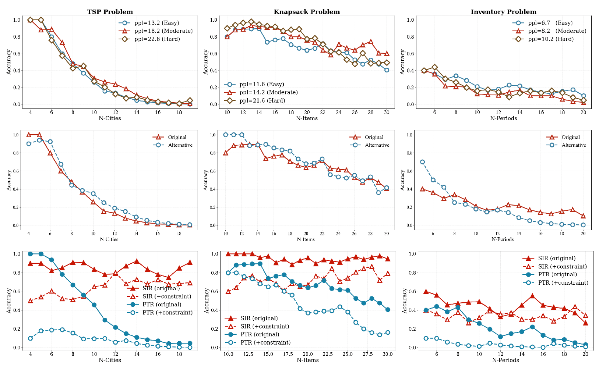

<h2 align="center"> OPT-Engine: Benchmarking the Limits of LLMs in Optimization Modeling via Complexity Scaling</h2>
<p align="center">
    <a href="https://icml.cc/virtual/2026/poster/61027"></a>
    <a href="https://arxiv.org/abs/2601.19924"></a>
    <a href="https://huggingface.co/chenyitian-shanshu/Qwen3-SIRL-4B"></a>
</p>

## Overview
We introduce **OPT-Engine**, an extensible benchmark framework for optimization problems with controllable complexity and configurable templates.
OPT-Engine spans ten canonical operations research problem classes,systematically scaling in complexity, thus provides a structured testbed for automated problem formulation and solving under different OR complexity.
OPT-Engine facilitates rigorous, reproducible studies on how problem complexity impacts model performance, offering a more granular look at LLM formulation and solving capabilities.



  1. First, we examine whether Pure-Text Reasoning (PTR) via classical Chain-of-Thought can efficiently tackle optimization tasks, finding that PTR suffers from a critical robustness gap as task complexity increases.  
   2. Second, we examine whether integrating external computational tools can mitigate PTR's arithmetic weaknesses and improve performance. Our results indicate that while such tools help with local calculations, they still fail to adhere to global optimization constraints.  
   3. Finally, we pinpoint that for the current SOTA paradigm, Solver-integrated Reasoning (SIR), the automated formulation of constraints represents the primary bottleneck.  


## Updates
- **2026.05.01** - Our paper has been accepted for a poster presentation at ICML 2026! 🔥
- **2026.01.29** - OPT-Engine paper published on arXiv: [OPT-Engine: Benchmarking the Limits of LLMs in Optimization Modeling via Complexity Scaling](https://arxiv.org/abs/2601.19924).


## The OPT-Engine Pipeline
For a given problem class, the **OPT-Engine** pipeline operates as follows:
   1. Numeric Instance Generation & Validation: It first samples a random numerical instance within a specified target complexity range, defined by parameters such as variable and constraint counts. A Gurobi-based exact solver then verifies the instance's feasibility and computes the optimal solution, which is stored as the ground truth.
   2. Canonical Problem Creation: Once validated, the framework maps the instance's numeric parameters into a structured, editable template to produce a canonical natural-language problem statement.
   3. Problem augumentation: To decouple linguistic variation from mathematical structure, the pipeline employs an LLM-based rephrasing step. This step alters the textual scenario and surface wording while strictly preserving the objective function, constraints, and all numerical values.
   4. Integrity Verification: A subsequent LLM-as-a-judge and rule-based validation check uses regex extraction to confirm that the rephrased text maintains the original numeric parameters and their logical relationships. If validation fails, the rephrasing step is retried until a valid output is produced.



## C^3-Bench Dataset
We also provide C^3-Bench (Controllable & Configurable Complexity Benchmark), a dataset generated by our framework to facilitate reproducible research and enable further studies.
The dataset is hosted alongside the complete OPT-Engine benchmark suite:
   1. C³-Bench Dataset (source data): Available on GitHub:  [C^3-Bench Dataset](https://github.com/Cardinal-Operations/OPTEngine/tree/main/test_data).
   2. OPT-Engine Benchmarks (ready-to-use): Hosted on Hugging Face Datasets for easy loading via the datasets library: [huggingface Dataset](https://huggingface.co/datasets/chenyitian-shanshu/OPTEngine).

   C³-Bench is structured into two complementary subsets for evaluating model performance on classical Operations Research (OR) problems under controlled complexity scaling:
   1. **canonical**: Contains standard instances of 10 canonical OR problem types, with complexity systematically increased across parameters like variable and constraint counts.
   2. **perturbation**: Contains derived instances where controlled linguistic and parametric perturbations are applied to a subset of the canonical benchmark (covering the Inventory, TSP, and Knapsack problems) to specifically test model robustness and generalization.

Within the perturbation set, we introduce controlled variations across three dimensions that are known performance bottlenecks:

   * **Linguistic Complexity**: The underlying mathematical model is held constant, while the natural language description is rephrased into templates with systematically higher syntactic and lexical complexity, creating harder-to-parse problem statements.

   * **Objective Perturbation**: A constant term or simple coefficient change is introduced to the objective function, testing the model's ability to adapt to modified goals while the constraints remain unchanged.

   * **Constraint Augmentation**: One additional simple linear constraint is introduced to the original formulation, testing how models handle incremental increases in problem structure without altering the core variables or objective.

##  PTR vs SIR
Our study, enabled by the C³-Bench dataset, addresses two critical questions about LLMs in optimization:
   1. Does LLM performance remain robust when generalizing to out-of-distribution optimization tasks that exceed the complexity levels of current benchmarks?
2. Does augmenting LLMs with computational tools enable Pure-Text Reasoning (PTR) to overcome its limitations and achieve performance comparable to Solver-integrated Reasoning (SIR)?

Here is an example of observation study of SIR vs PTR:



 we conduct an error‑decomposition experiment that distinguishes between constraint feasibility and computational accuracy.


- **SIR (Solver‑Integrated Reasoning):** Accuracy is contingent upon structural feasibility.
- **PTR (Pure‑Text Reasoning):** Exhibits a dual‑failure trajectory:
  - **Reasoning Collapse:** As problem complexity scales, the model fails to maintain global logical constraints.
  - **Precision Deficit:** Lacks the deterministic precision required to attain exact mathematical optima.
- **CompPTR (Computationally‑augmented PTR):** External computational support mitigates arithmetic errors, but cannot maintain a coherent global optimization strategy — performance degrades as problem size grows.


## The Primary bottleneck

Based on the structural properties of optimization problems, we examine three dimensions: (1) Linguistic Complexity, (2) Objective Perturbations, and (3) Constraint Augmentation.



The Semantic Sensitivity Bottleneck. We identify a critical "semantic sensitivity" failure mode: even frontier LLMs struggle to maintain formulation fidelity when the linguistic expression of constraints deviates from canonical problem descriptions. This reveals a major bottleneck in reliable automated problem-solving.

## Citation
If you find OPT-Engine useful or relevant to your research, please consider citing our paper:

```bibtex
@article{chen2026opt,
  title={OPT-Engine: Benchmarking the Limits of LLMs in Optimization Modeling via Complexity Scaling},
  author={Chen, Yitian and Cheng, Cheng and Sun, Yinan and Ling, Zi and Ge, Dongdong},
  journal={arXiv preprint arXiv:2601.19924},
  year={2026}
}
```

## Contact
For any questions or issues regarding the pipeline or datasets, please raise an issue on our GitHub repository or contact one of the authors via emails:

Yitian Chen, yitianartsky@gmail.com

Cheng Cheng, clairecheng0709@gmail.com

